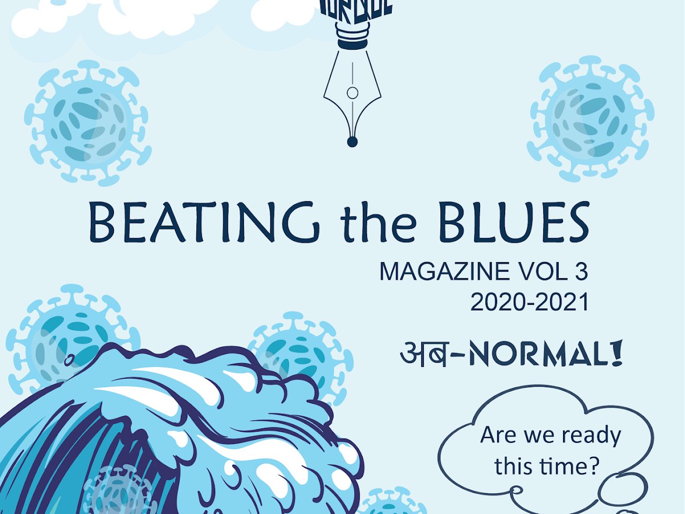
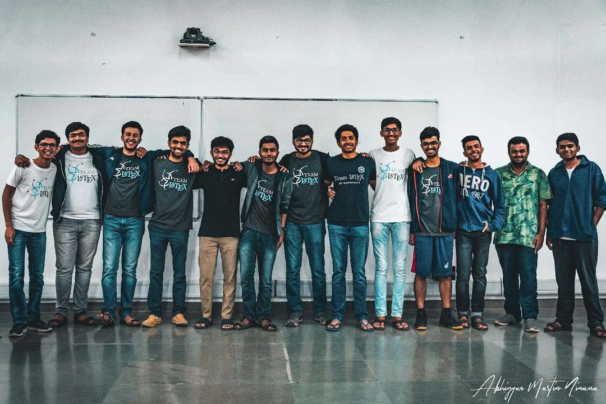

## Rubik's Cube

My journey with the Rubik's cube started way back in class 5 when I was fascinated with the puzzle. Slowly I started getting better at solving it, when in class 10, I was able to solve in just around 13 seconds! I slowly adapted myself to solving a variety of different twisty puzzles, and can today solve more than 15 kinds of twisties!

## Sports - Table Tennis

{% include carousel.html height="50" unit="%" duration="7" number="2" %}

- Part of Carnegie Mellon University team currently.

- Made my entry into IITGN's Table tennis team in my first year, where I was the lead player for the team. I represented the institute for table tennis throughout various tournaments, most notably the Inter IIT Sports meet of 2018 (IIT Guwahati, lost in group stage) and 2019 ( IIT Bhubaneswar, lost at QF vs IIT Roorkee).

- Institute Secretary of Table Tennis ('19 - '20) - managed all aspects of table tennis culture at IITGN include budgeting, infrastructure, and event management

- Launched the first ever Intra IITGN Table Tennis League (IITL)  with over 100 participants in 6 teams. 

- Former State player in Tamil Nadu

## Instruments

<iframe width="420" height="315" src="http://www.youtube.com/embed/hccr3vX6kyw" frameborder="0" allowfullscreen></iframe>

I play the keyboard when I want to feel at peace :) This is a cover of Fur Elise that I did a while back.

## Torque

Torque is the annual campus magazine of IITGN. I joined the Torque 3.0 team as the Chief Editor of the Editorial Board. It took a lot of effort to write, collaborate, and go from releasing the online version of the magazine to actually printing it amidst a pandemic!

## Amalthea

{% include carousel.html height="50" unit="%" duration="7" number="1" %}

Amalthea - Annual Technical Summit of IITGN

- I joined Amalthea in my first year where I was part of the Conclave and Symposium team. During the event, I had the opportunity to accompany Dr JN Goswami during his visit to IITGN

- In my second year, I was promoted to head the Conclave team, and invited and hosted several dignitaries from across the nation including , Dr S Christopher - Former Chairman, DRDO, Mr Sudarshan Sen - Former Executive Director RBI, Dr Tapan Misra - Former Director of SAC, ISRO among many others

## Team LaTeX

Team LaTeX was born with the spirit of inculcating a technical culture in the institute.  LaTeX is a popular typesetting tool used in most academic works, and we hosted a two day workshop to improve the understanding of LaTeX amongst the students of IITGN. In my first year, I was a organizer, and in my second year, managed the entire event.

## Writing

I occasionally like to write on my experiences and things that I did uniquely. Checkout some of my articles below.

- GRE: My Test Centre Experience | by Praveen Venkatesh | Medium 

- Cracking the MITACS Globalink Research Internship (GRI) | by Praveen Venkatesh | Medium  - Record number of people cracked MITACS from IITGN after the article. Correlation --> Causation? I hope so :)

- Invent@IITGN 2019 Experience - Praveen | Academic Council | IIT Gandhinagar 

- Pandemic? What pandemic? We’re Innovators! - Torque 

An old blog website that I had. A peek into 2nd year Praveen XD - Random Thoughts – A peek into my mind (wordpress.com) 

More on my experiences on applying to grad school, and how I dominated GRE and TOEFL. Stay tuned...

## Teaching and Mentoring

- Spring '22 - Peer Assisted Learning Mentor: Guiding and teaching freshmen who have difficulty in adjusting to college life in English

- Fall '21 - Teaching Assistant: For the graduate level Natural Language Processing course - Initiated and supervised 4 projects as part of the course.

- Spring '21 - Academic Discussion Hours Mentor: Mentored and taught concepts to freshmen for the Introduction to Analog and Digital Electronics course.

- Fall '20 - Academic Discussion Hours Mentor: Mentored and taught concepts to sophomores for the Digital Systems course.

- Python for Robotics Workshop: Introduction to Robotics -  Hosted a workshop using a library that I developed for python.